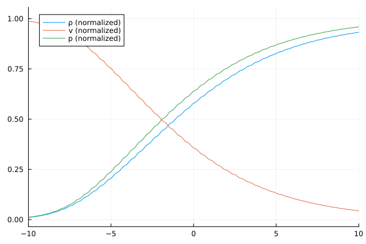

# Shock Structure Example

This tutorial mirrors the setup from examples/Shock_1D1D.jl with parameters chosen for the shock structure test case (Ma=1.4). 
It evolves a one-dimensional shock structure and stores the resulting density/velocity/pressure profile.
Note: The grid is usually finer, and is coarsened for this example.

``` julia
if !endswith(Base.active_project(), "../Project.toml")
    import Pkg; Pkg.activate(".")
end # Runs in environment setup
using ExtGram, Trixi, OrdinaryDiffEq, Plots, CSV, Tables

# General parameter
M = 4
closure = "ExtGram" # possible: "Gram", "ExtGram" or "Grad"
Kn = 1.0
source = relaxation_source # if "zero_source" Kn doesn't matter, as no source term

T_end = 25.0
base_tree_level = 8 # 10 used in thesis, but let's speed it up a bit
polydeg = 1
x_lower = -20.0
x_upper = 100.0

# Fixed settings
domain = (x_lower, x_upper)

Ma = 1.4 # Mach number

# Initial conditions
ρ_L = 1.0
ρ_R = (2*Ma^2) / (Ma^2 + 1)
v_L = sqrt(3) * Ma
v_R = sqrt(3) / 2 * (Ma^2 + 1) / Ma
θ_L = 1.0
θ_R = (3*Ma^2 - 1) * (Ma^2 + 1) / (4 * Ma^2)

# Setting up everything
basis, mesh, equations, initial_condition, solver, boundary_conditions = setupGramianMomentEquations1DShockTube(
    M, Kn, closure,
    Maxwellian(ρ_L, v_L, θ_L), # Density, velocity, temperature
    Maxwellian(ρ_R, v_R, θ_R);
    base_tree_level = base_tree_level,
    domain = domain,
    polydeg = polydeg,
)

semi = SemidiscretizationHyperbolic(
    mesh, equations, 
    initial_condition, solver, 
    boundary_conditions=boundary_conditions, 
    source_terms=source
)

# ODE (time integration)
tspan = (0.0, T_end)
ode = semidiscretize(semi, tspan)

# callbacks
callbacks, summary_callback = callbacksGramianMomentEquations(
    semi, tspan, basis; 
    cfl = 0.9,          # Maximum cfl number
    plot_interval = 20,  # plot every 20 steps
    name="gram_solution",
)

# solve
sol = solve(
    ode, 
    CarpenterKennedy2N54(
        williamson_condition = false
    );
    dt = 1.0, # solve needs some value here but it will be overwritten by the stepsize_callback
    ode_default_options()..., 
    callback = callbacks,
    saveat = range(tspan[1], tspan[2], length=100)
);

summary_callback()

# Visualization
x, ρ, v, p, p1 = plot_ρ_v_p(sol, M, x_lower, x_upper)

p1 = plot(xlims = (-10, 10))
plot!(p1, x, (ρ .- ρ_L) ./ (ρ_R .- ρ_L), label="ρ (normalized)")
plot!(p1, x, (v .- v_R) ./ (v_L .- v_R), label="v (normalized)")
plot!(p1, x, (p .- ρ_L * θ_L) ./ (ρ_R * θ_R .- ρ_L * θ_L), label="p (normalized)")
display(p1)
```


