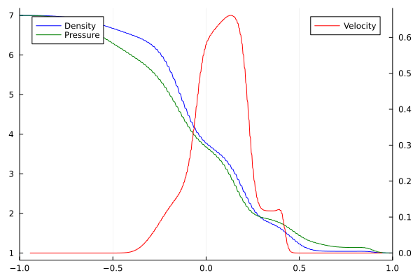

# Shock Structure Example

This tutorial mirrors the setup from examples/Shock_1D1D.jl with parameters chosen for the shock structure test case (Ma=1.4). 
It evolves a one-dimensional shock structure and stores the resulting density/velocity/pressure profile.
Note: The grid is usually finer, and is coarsened for this example.

``` julia
if !endswith(Base.active_project(), "../Project.toml")
    import Pkg; Pkg.activate(".")
end # Runs in environment setup
using ExtGram, Trixi, OrdinaryDiffEq, Plots, CSV, Tables

# General parameter
M = 4
closure = "ExtGram" # possible: "Gram", "ExtGram" or "Grad"
Kn = 1.0
source = relaxation_source # if "zero_source" Kn doesn't matter, as no source term

T_end = 0.3
base_tree_level = 8 # 10 used in thesis, but let's speed it up a bit
polydeg = 1
x_lower = -2.0
x_upper = 2.0

# Fixed settings
domain = (x_lower, x_upper)

# Initial conditions
ρ_L = 7.0
v_L1 = 0.0
v_L2 = 0.0
v_L3 = 0.0
θ_L = 1.0
ρ_R = 1.0
v_R1 = 0.0
v_R2 = 0.0
v_R3 = 0.0
θ_R = 1.0

# Setting up everything
equations = GramianMomentEquations1D3D(M, Kn, closure)

initial_condition = InitialConditionsShockTube1D3D(
    Maxwellian1D3D(ρ_L, (v_L1, v_L2, v_L3), θ_L), # Density, velocity, temperature
    Maxwellian1D3D(ρ_R, (v_R1, v_R2, v_R3), θ_R), # Shock in density, but not velocity, temperature initially
    M,
    equations
)

#= set up semidiscretization =#
basis = LobattoLegendreBasis(polydeg)

# shock capturing
indicator_sc = IndicatorHennemannGassner(
    equations, basis,
    alpha_max = 0.15, 
    alpha_min = 0.001, 
    alpha_smooth = true,  # smoothes with all neighboring indicators to remove numerical artifacts
    variable = (u, eqns)->u[1]*u[5]
)

surface_flux = flux_lax_friedrichs
volume_flux = flux_central
volume_integral = VolumeIntegralShockCapturingHG(
    indicator_sc;
    volume_flux_dg = volume_flux,
    volume_flux_fv = surface_flux
)

solver = DGSEM(basis, surface_flux, volume_integral)

mesh = TreeMesh(
    (domain[1],), (domain[2],), 
    initial_refinement_level=base_tree_level, 
    n_cells_max=10_000, 
    periodicity=false
)

boundary_conditions = (x_neg = BoundaryConditionDirichlet(initial_condition), x_pos = BoundaryConditionDirichlet(initial_condition))

semi = SemidiscretizationHyperbolic(
    mesh, equations, 
    initial_condition, solver, 
    boundary_conditions=boundary_conditions, 
    source_terms=source
)

#= set up ODE =#
tspan = (0.0, T_end)
ode = semidiscretize(semi, tspan)

cfl = 0.99
time_interval = 20

alive_callback = AliveCallback(analysis_interval=100)
summary_callback = SummaryCallback()
stepsize_callback = StepsizeCallback(cfl=cfl)

plot_interval = 20  # plot every 20 steps
plot_callback = VisualizationCallback(
    semi;
    interval=plot_interval,
    solution_variables=cons2cons,
    plot_data_creator=PlotData1D,
    plot_creator=Trixi.show_plot,
)

callbacks = CallbackSet(
    alive_callback,
    stepsize_callback,
    plot_callback,
)

#= solve =#
sol = solve(
    ode, 
    CarpenterKennedy2N54(
        williamson_condition = false
    );
    dt = 1.0, # solve needs some value here but it will be overwritten by the stepsize_callback
    ode_default_options()...,
    callback = callbacks,
);

summary_callback()

# Post-Processing
n_equations = 10
u_final = sol.u[end]
L = length(u_final)
Nloc = L ÷ (n_equations)
Fmat = reshape(u_final, n_equations, Nloc)
x = range(x_lower, x_upper, length=Nloc)

u = []
for i in 1:n_equations
    push!(u, Fmat[i, :])
end

rho = u[1];
v = u[2] ./ u[1];
theta = 1 ./ (3 .* rho) .* (u[3] .+ 2 .* u[4] .- rho .* v.^2);
p = rho .* theta;

# Visualization
p1 = plot(xlims = (-1.0, 1.0));
plot!(p1, x, rho, color=:blue, label="Density", legend=:topleft)
plot!(twinx(p1), x, v, color=:red, label="Velocity", legend=:topright)
plot!(p1, x, p, color=:green, label="Pressure")
```


