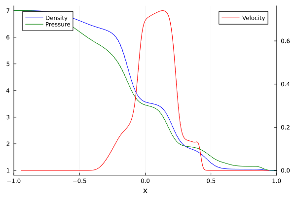

# 1D3V Shock Tube Example

This tutorial mirrors the setup from examples/Shock_1D3VSlab.jl with parameters chosen for the shock tube test case.
It evolves a one-dimensional shock tube whose distribution function depends on all three velocity components ("1D3V").
Note: The grid is usually finer, and is coarsened for this example.

The 1D3V system evolves the moments ``U_{(\alpha\beta\gamma)} = \int f\, v_x^\alpha v_y^\beta v_z^\gamma \,\mathrm{d}v`` with ``\alpha+\beta+\gamma \le M``,

```math
\partial_t U_{(\alpha\beta\gamma)} + \partial_x U_{(\alpha+1,\beta\gamma)} = S_{(\alpha\beta\gamma)}.
```

The moments of total order ``M+1`` that appear in the flux are supplied by the (extended) Gramian closure, which is evaluated along a set of directions in velocity space (see [`GramianMomentEquations1D3V`](@ref)).

### Load the necessary Packages

```julia
if !endswith(Base.active_project(), "../Project.toml")
    import Pkg; Pkg.activate(".")
end # Runs in environment setup
using ExtGram, Trixi, OrdinaryDiffEq, Plots, StaticArrays
```

### Setup

Start with the number of moments, closure, Knudsen number and source term

```julia
M = 4
closure = "ExtGram" # possible: "Gram", "ExtGram" or "Grad"
Kn = 1.0
source = relaxation_source # if "zero_source" Kn doesn't matter, as no source term
```

### Geometry: slab symmetry or full 1D3V

[`GramianMomentEquations1D3V`](@ref) supports two geometries, selected with the keyword `slab_geometry`:

- `slab_geometry = true` (slab geometry): the distribution function is assumed to be symmetric under ``v_y \to -v_y``, ``v_z \to -v_z`` and under the swap ``v_y \leftrightarrow v_z``. Moments with an odd power of ``v_y`` or ``v_z`` vanish, and mirror images such as ``U_{(020)}`` and ``U_{(002)}`` coincide, so only the representatives ``U_{(\alpha\beta\gamma)}`` with ``\beta, \gamma`` even and ``\beta \ge \gamma`` are evolved. This is the setting used by examples/Shock_1D3VSlab.jl. It requires ``v_y = v_z = 0`` in the initial data.
- `slab_geometry = false` (full 1D3V): all moments with ``\alpha+\beta+\gamma \le M`` are evolved and no symmetry is assumed. Note that this solves a much larger system of PDEs and with that requires much more computational resources.

```julia
slab_geometry = true   # slab geometry: 10 equations for M = 4
# slab_geometry = false  # full 1D3V:    35 equations for M = 4
```

The system sizes for the closure orders used in the examples are

| M | equations (full 1D3V) | equations (slab) | closure directions (full 1D3V) | closure directions (slab) |
|:-:|:-:|:-:|:-:|:-:|
| 4 |  35 | 10 | 21 | 4 |
| 6 |  84 | 20 | 36 | 6 |
| 8 | 165 | 35 | 55 | 9 |

### Closure directions

The 1D closure is evaluated along ``N_\text{shell}`` directions ``n(\theta, \varphi)`` (the last two columns of the table above). By default a Fibonacci spiral on the hemisphere is used, which is well conditioned:

```julia
equations = GramianMomentEquations1D3V(M, Kn, closure; slab_geometry=slab_geometry)
```

Alternatively, the directions can be prescribed with the keywords `theta` and `phi`. They must contain exactly ``N_\text{shell}`` angles, so the angle sets of examples/Shock_1D3VSlab.jl (4 angles for ``M = 4``) are only valid in slab geometry:

<!-- skip -->
```julia
theta = [3.14159, 0.684719, 2.03444, 2.18628] # M = 4, slab geometry only
phi   = [1.5708, 4.71239, 1.5708, 0.886077]
equations = GramianMomentEquations1D3V(M, Kn, closure; slab_geometry=true, theta=theta, phi=phi)
```

### Numerical settings and initial conditions

```julia
T_end = 0.3
base_tree_level = 8 # >=10 is advised, but let's speed it up a bit
polydeg = 1
x_lower = -2.0
x_upper = 2.0

# Fixed settings
domain = (x_lower, x_upper)
```

The shock tube is initialized with two Maxwellians. Slab geometry requires vanishing transverse velocities.

```julia
ρ_L = 7.0
v_L = (0.0, 0.0, 0.0) # (v_x, v_y, v_z)
θ_L = 1.0
ρ_R = 1.0
v_R = (0.0, 0.0, 0.0)
θ_R = 1.0

initial_condition = InitialConditionsShockTube1D3V(
    Maxwellian1D3V(ρ_L, v_L, θ_L), # Density, velocity, temperature
    Maxwellian1D3V(ρ_R, v_R, θ_R), # Shock in density, but not velocity, temperature initially
    M,
    equations
)
```

### Set up the numerical solver

The shock capturing indicator uses ``\rho\, U_{(200)}``, the analogue of ``\rho\, U_2`` in the 1D1D setup. `ExtGram.moment_val` looks a moment up by its multi-index and therefore works in both geometries.

```julia
basis = LobattoLegendreBasis(polydeg)

# shock capturing
indicator_sc = IndicatorHennemannGassner(
    equations, basis,
    alpha_max = 0.15, 
    alpha_min = 0.001, 
    alpha_smooth = true,  # smoothes with all neighboring indicators to remove numerical artifacts
    variable = (u, eqns) -> u[1] * ExtGram.moment_val(u, 2, 0, 0, eqns) # ρ U_(200)
)

surface_flux = flux_lax_friedrichs
volume_flux = flux_central
volume_integral = VolumeIntegralShockCapturingHG(
    indicator_sc;
    volume_flux_dg = volume_flux,
    volume_flux_fv = surface_flux
)

solver = DGSEM(basis, surface_flux, volume_integral)

mesh = TreeMesh(
    (domain[1],), (domain[2],), 
    initial_refinement_level=base_tree_level, 
    n_cells_max=10_000, 
    periodicity=false
)

boundary_conditions = (x_neg = BoundaryConditionDirichlet(initial_condition), x_pos = BoundaryConditionDirichlet(initial_condition))

semi = SemidiscretizationHyperbolic(
    mesh, equations, 
    initial_condition, solver, 
    boundary_conditions=boundary_conditions, 
    source_terms=source
)
```

with the ODE problem

```julia
tspan = (0.0, T_end)
ode = semidiscretize(semi, tspan)
```

and the callbacks. The visualization callback is restricted to a few moments by name, since the full system has 35 variables.

```julia
cfl = 0.99

alive_callback = AliveCallback(analysis_interval=100)
summary_callback = SummaryCallback()
stepsize_callback = StepsizeCallback(cfl=cfl)

plot_interval = 20  # plot every 20 steps
plot_callback = VisualizationCallback(
    semi;
    interval=plot_interval,
    solution_variables=cons2cons,
    variable_names=["U_(000)", "U_(100)", "U_(200)"],
    plot_data_creator=PlotData1D,
    plot_creator=Trixi.show_plot,
)

callbacks = CallbackSet(
    summary_callback,
    alive_callback,
    stepsize_callback,
    plot_callback,
)
```

### Solve the problem

```julia
sol = solve(
    ode, 
    CarpenterKennedy2N54(
        williamson_condition = false
    );
    dt = 1.0, # solve needs some value here but it will be overwritten by the stepsize_callback
    ode_default_options()...,
    callback = callbacks,
);

summary_callback()
```

### Post Processing

Density, velocity and pressure are obtained from the primitive (central) moments. `cons2prim` and `ExtGram.temperature` handle both geometries, so this block does not change with `slab_geometry`.

```julia
n_equations = nvariables(equations)
Fmat = reshape(sol.u[end], n_equations, :)
x = vec(semi.cache.elements.node_coordinates)

prim = [cons2prim(SVector{n_equations}(Fmat[:, i]), equations) for i in axes(Fmat, 2)]
rho = [w[1] for w in prim]
v = [w[2] for w in prim]                                   # v_x
theta = [ExtGram.temperature(w, equations) for w in prim] # (P_(200) + P_(020) + P_(002)) / (3ρ)
p = rho .* theta

# Visualization
p1 = plot(xlims = (-1.0, 1.0), xlabel = "x");
plot!(p1, x, rho, color=:blue, label="Density", legend=:topleft)
plot!(twinx(p1), x, v, color=:red, label="Velocity", legend=:topright)
plot!(p1, x, p, color=:green, label="Pressure")
display(p1)
```

Slab geometry (`slab_geometry = true`):



Full 1D3V (`slab_geometry = false`):


