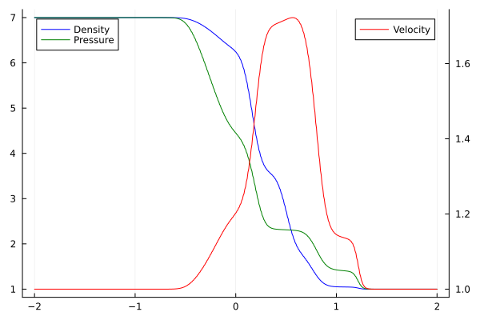
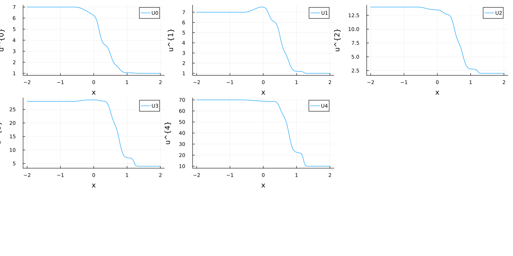

# Shock Tube Example

This tutorial mirrors the setup from examples/main.jl with parameters tuned for a fast documentation build. It evolves a one-dimensional shock tube and stores the resulting density/velocity/pressure profile.

``` julia
if !endswith(Base.active_project(), "../Project.toml")
    import Pkg; Pkg.activate(".")
end # Runs in environment setup
using HyQMOM, Trixi, OrdinaryDiffEq, Plots, CSV, Tables
```

### Setup

Start with the number of moments, closure, and the Knudsen number

``` julia
M = 4
closure = "ExtGram"
Kn = 1.0
```

continue with the numerical setting
``` julia
T_end = 0.3
x_lower, x_upper = -2.0, 2.0
polydeg = 1
base_tree_level = 8
surface_flux = flux_lax_friedrichs
volume_flux = flux_central
```

and the initial conditions
```julia
ρ_L = 7.0
v_L = 1.0
θ_L = 1.0
ρ_R = 1.0
v_R = 1.0
θ_R = 1.0

# Setting up everything
equations = GramianMomentEquations1D(M, Kn, closure)
initial_condition = InitialConditionsShockTube(
    Maxwellian(ρ_L, v_L, θ_L), # Density, velocity, temperature
    Maxwellian(ρ_R, v_R, θ_R), # Shock in density, but not velocity, temperature initially
    equations
)
```

### Set up the numerical solver

The solver

``` julia
basis = LobattoLegendreBasis(polydeg)

# shock capturing
indicator_sc = IndicatorHennemannGassner(
    equations, basis,
    alpha_max = 0.5,
    alpha_min = 0.001,
    alpha_smooth = true,
    variable = (u, eqns)->u[1]*u[3]
)

volume_integral = VolumeIntegralShockCapturingHG(
    indicator_sc;
    volume_flux_dg = volume_flux,
    volume_flux_fv = surface_flux
)

solver = DGSEM(basis, surface_flux, volume_integral)
````

and the semidiscretization

``` julia
mesh = TreeMesh(
    (domain[1],), (domain[2],), 
    initial_refinement_level=base_tree_level, 
    n_cells_max=10_000, 
    periodicity=false
)

boundary_conditions = (x_neg = BoundaryConditionDirichlet(initial_condition), x_pos = BoundaryConditionDirichlet(initial_condition))

semi = SemidiscretizationHyperbolic(
    mesh, equations, 
    initial_condition, solver, 
    boundary_conditions=boundary_conditions, 
    source_terms=source
)
````

with the ode problem

``` julia
tspan = (0.0, T_end)
ode = semidiscretize(semi, tspan)
```

and the callbacks

``` julia
callbacks, summary_callback = callbacksGramianMomentEquations(
    semi, tspan, basis; 
    cfl = 0.9,          # Maximum cfl number
    plot_interval = 20,  # plot every 20 steps
    name="gram_solution",
)
```

### Solve the problem

``` julia
sol = solve(
    ode, 
    CarpenterKennedy2N54(
        williamson_condition = false
    );
    dt = 1.0, # solve needs some value here but it will be overwritten by the stepsize_callback
    ode_default_options()..., 
    callback = callbacks,
    saveat = range(tspan[1], tspan[2], length=100)
);
```

### Post Processing

Visualize the density, velocity, and pressure

``` julia
x, ρ, v, p, p1 = plot_ρ_v_p(sol, M, x_lower, x_upper)
display(p1)
```



or visualize all the (conservative) moments separately

``` julia
u_final = sol.u[end]
L = length(u_final)
Nloc = L ÷ (M + 1)
Fmat = reshape(u_final, M+1, Nloc)

u = []
for i in 1:(M+1)
    push!(u, Fmat[i, :])
end

# Plot first moments
pl = Vector{Any}(undef, M+1)
x = range(x_lower, x_upper, length=Nloc)

for i in 1:(M+1)
    pl[i] = scatter()
    plot!(
        pl[i],
        xlabel="x",
        ylabel="u^{$(i-1)}",
    )
    plot!(
        pl[i],
        x, u[i], 
        label="U$(i-1)",
    )
end

display(pl)
l = @layout  [grid(3,3)]
plot(pl..., layout=l, size=(1_200, 600))
```

